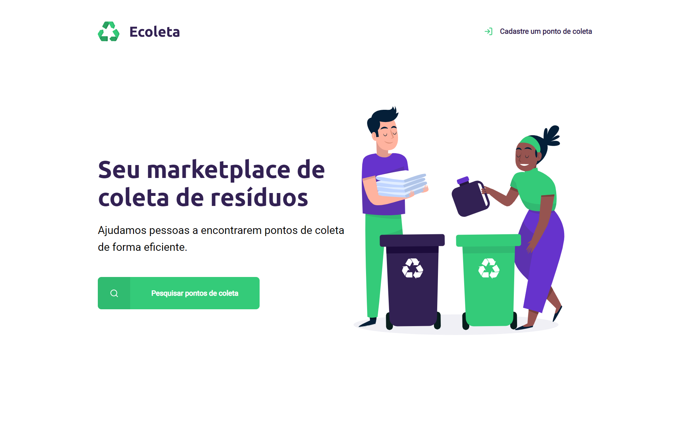
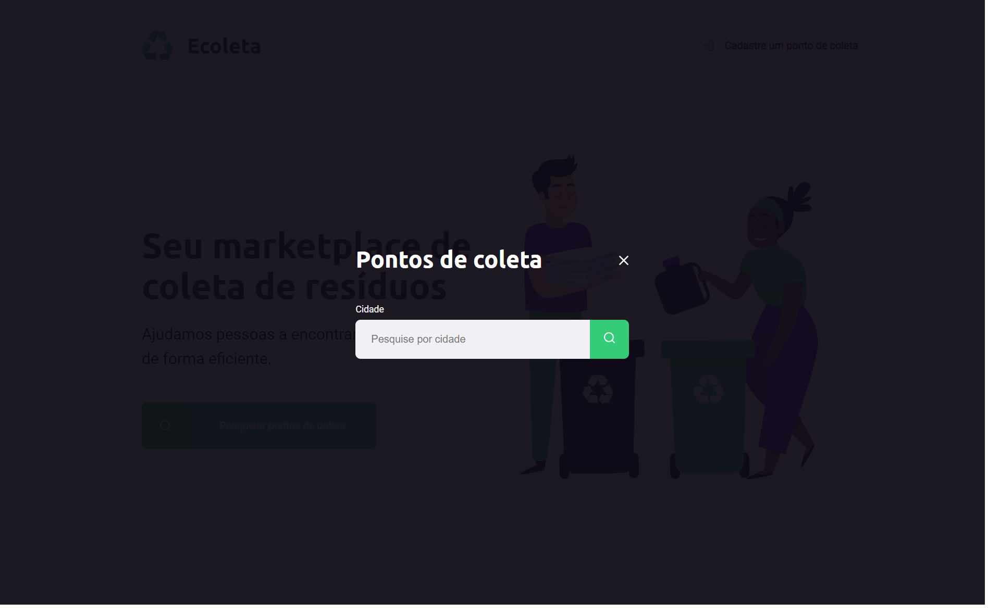
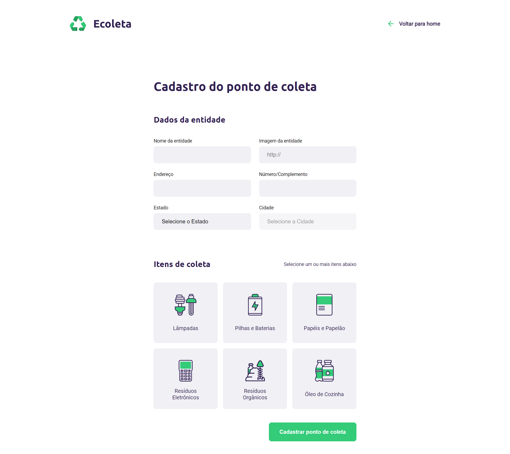

<h1>Ecoleta ♻️</h1>

Site de criação e pesquisa de pontos de coleta de resíduos para reciclagem criado pela Rocketseat para a semana Next Level Week.

    
    
    

<h2>🚀 Tecnologias</h2>
<ul>
    <li> Node.js</li>
    <li> Express</li>
    <li> SQLite3</li>
    <li> Nunjucks</li>
    <li> Nodemon</li>
</ul>

<h2>🔧 Instalação</h2>
<h3>Pré-requisitos:</h3>
<ul>
    <li>Node.js</li>
    <ol>
        <li>Vá ao site <a href="https://nodejs.org/en/download/" title="Site Node.js">https://nodejs.org/en/download/</a></li>
        <li>Escolha a versão de acordo com o seu sistema operacional.</li>
    </ol>
</ul>
OBS: o NPM já vem acompanhado do Node.js.
<h3>Dependências:</h3>
<ul>
    <li>Express</li>
    <li>Nodemon</li>
    <li>Nunjucks</li>
    <li>SQLite3</li>
</ul>
<h3>Para instalar as dependências:</h3>
<ol>
    <li>
        Clone o repositório:
        <code>git clone https://github.com/ana-ferreiramg/nlw-ecoleta.git</code>
    </li>
    <li>
        Use o comando:
        <code>npm install</code>
    </li>
</ol>
<h2>🚩 Rodar aplicação</h2>

    Dentro do diretório do projeto use o comando:
    <code>npm start</code>
     
    O app vai abrir em modo de desenvolvimento.

Para ver o resultado, basta abrir seu browser e acessar: http://127.0.0.1:3000/

